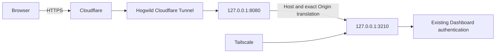
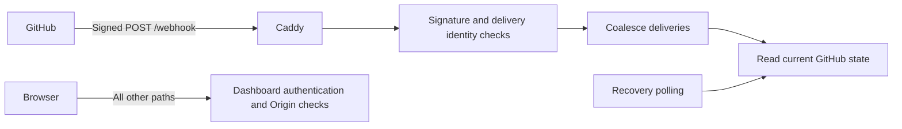

# Public Dashboard

The Dashboard uses `https://agent.harlanzw.com` through Hogwild's existing Cloudflare Tunnel.
Sign in as `agent` with the existing Dashboard password.
The Service still binds `127.0.0.1:3210`.



## Install

The tunnel forwards to Caddy at `http://127.0.0.1:8080`.
Caddy imports `/etc/caddy/routes/*.caddy` inside that listener.

Copy `scripts/30-agent.caddy` to Hogwild, then install it:

```sh
sudo install -m 0644 30-agent.caddy /etc/caddy/routes/30-agent.caddy
sudo caddy validate --config /etc/caddy/Caddyfile
sudo systemctl reload caddy
```

If validation fails, remove the new route before retrying.
Keep any previous route outside the imported directory for rollback.

Create a proxied CNAME for `agent.harlanzw.com`:

```text
01ae8636-4e43-4a6e-b658-856c1e3cce15.cfargotunnel.com
```

See [Cloudflare DNS routing](https://developers.cloudflare.com/tunnel/routing/).
The Service configuration keeps `server.allowed_origin: https://hogwild.tailcad325.ts.net`.
No Service restart is needed.

## Request protection

Caddy redirects public HTTP requests to HTTPS.
The Dashboard checks its existing password on every route.
Caddy translates the public Host to the Service's configured Host.

For methods other than GET and HEAD, Caddy requires `Origin: https://agent.harlanzw.com`.
It translates that exact Origin for the Service's own check.
It rejects missing, foreign, and Tailscale origins on the public route.
Never replace every Origin with the allowed value.
See [Caddy header replacement](https://caddyserver.com/docs/caddyfile/directives/reverse_proxy#headers).

Responses retain the Dashboard's `Cache-Control: no-store` and content security policy.
Keep Cloudflare cache overrides disabled for this hostname.

## Verify

Check the public hostname after each route change:

- Unauthenticated `/`, `/health`, and `/api/state` return 401.
- Incorrect credentials return 401.
- Correct credentials load the Dashboard and `/api/state`.
- An authenticated POST to `/__origin-check` returns 404 with the public Origin.
- That POST returns 403 with a missing, foreign, or Tailscale Origin.
- Public HTTP redirects to HTTPS.
- Authenticated responses retain `Cache-Control: no-store` and do not return a cache hit.

The nonexistent POST route tests Origin handling without changing Service state.
The Tailscale address retains its existing access.
The Dashboard's live Hogwild metrics remain available through Tailscale only.

## Rollback

Remove the `agent.harlanzw.com` DNS record.
Remove `/etc/caddy/routes/30-agent.caddy`, validate Caddy, then reload it.
If replacing a previous route, restore that route instead.

## GitHub webhooks

The same hostname accepts GitHub deliveries at `https://agent.harlanzw.com/webhook`.
Caddy sends only that exact path to the separate listener on `127.0.0.1:3211`.
GitHub signatures authenticate deliveries. They do not use the Dashboard password or browser Origin.
Every other path keeps the existing Dashboard authentication and Origin checks.
The request body limit is 25 MB.



After this change merges, update the Service and install the Caddy route using the commands above.
Create a secret on Hogwild without printing it:

```sh
umask 077
if [ ! -e ~/.config/wolfstar-github-agent/webhook-secret ]; then
  openssl rand -hex 32 > ~/.config/wolfstar-github-agent/webhook-secret
fi
```

Generate it once. If a secret already exists, keep it.
Add this block to `~/.config/wolfstar-github-agent/config.yml`:

```yaml
webhook:
  enabled: true
  port: 3211
  secret_path: /home/wolfstar/.config/wolfstar-github-agent/webhook-secret
```

Use `pnpm service:hogwild:restart` to let active Agents finish before the Service restarts.
Keep `poll_interval_seconds` unchanged until real deliveries succeed.

In [GitHub App settings](https://github.com/settings/apps/wolfstar-github-agent), enable Active under Webhook.
Set the URL above and the same secret. Keep SSL verification enabled.
Under Permissions and events, subscribe to:

- Check run and Check suite
- Commit status
- Issue comment and Issues
- Pull request and Pull request review
- Push

Use Recent deliveries to redeliver an event. Require a 204 response and a matching `Webhook:` Service log.
Unsigned requests to `/webhook` must return 401.
Requests to `/webhook/` and `/api/state` must still use Dashboard protection.
Repeat the Origin checks above after installing the route.

The listener remembers up to 10,000 delivery identities for one hour.
A restart clears that cache. Repeated reads remain safe because GitHub supplies the current state.
Deliveries during a read schedule at most one follow-up read.
Polling recovers deliveries missed during shutdown or connection failures.
GitHub does not automatically redeliver failed deliveries.
See [GitHub delivery recovery](https://docs.github.com/en/webhooks/using-webhooks/handling-failed-webhook-deliveries).

To disable deliveries, clear Active in GitHub App settings and set `webhook.enabled: false`.
Restart through the same Service command. Keep polling enabled.
