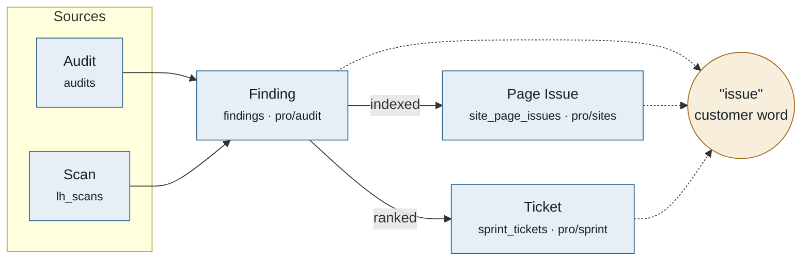

# GLOSSARY.md format

`GLOSSARY.md` has four sections in this order: Map, Terms, Banned, Open questions. A repository that enforces commit scopes adds Scopes after Banned.

## Map syntax

`## Map` is the first section, before any term definition. Write it in Mermaid, which GitHub renders natively inside a fenced ` ```mermaid ` block in any `.md` file, plus the table from the section above. No image files, no external tooling, still a plain-text diff.

Use `flowchart LR` and stage the pipeline left to right: sources, the detected concept, its consumers, what each is persisted as. Give every internal term a class, and attach the customer word as its own node so a shared word is visibly shared rather than repeated as text.

````md
## Map



Collisions
"issue" Finding, Page Issue, Ticket all surface here — three producers, one word
"problem" a value on both `kind` and `materiality`, different meaning on each
````

Rules for the map:

- **One customer word, one node.** Three dotted arrows converging on a single `"issue"` node is the drift argument. Repeating the word as a label on three boxes hides it.
- **Solid arrows for production, dotted for surface crossing.** They are different relationships and should not read alike.
- **Label the arrow with what moves** (`ranked`, `indexed`, `deduped`), not with a verb like `has`.
- Use `classDef` to separate internal from customer-facing. Two colours is enough; a third for collisions if the diagram earns it.
- Keep node text to the term plus its table and owner. Definitions live in `## Terms`, not in the box.
- Follow the diagram with a plain-text `Collisions` list. Mermaid does not render everywhere, and the collisions are the part that must survive a plain-text read.
- Redraw whenever a term is added or a collision is resolved.
- **`## Map` holds three things and nothing else**: the table, an optional diagram, and the `Collisions` list. No narrative, no rationale, no per-term commentary. Reasoning about a term belongs in `## Terms`; reasoning about an unresolved choice belongs in `## Open questions`. The budget is on **prose, which should be zero**, not on the artefacts: a table needs one row per term and a diagram costs what it costs, so never drop a term or a required diagram to hit a line count.

The worked examples in this skill use a Sprint/Finding/Ticket domain. They are illustrative only. Do not grep the target repo for the example's words.

## `## Open questions` format

Mandatory section, and on a real run the most useful one in the file. One entry per decision you could not make. Each carries the evidence, the options with their costs, and no recommendation dressed as a conclusion.

```md
## Open questions

Naming calls this file does not settle. Resolve one, fold the answer in, delete the entry.

1. **Does `indexing status` mean the GSC verdict or our derived state?**
   Both, today: `pages.indexing_status` stores the derived value, and the
   dashboard column of the same name shows the GSC verdict.
   - Rename the derived column, migration, no customer impact.
   - Rename the UI column, no migration, changes a screen customers know.
   - Keep both, record the axis on each, accept that readers must infer.
```

## `## Scopes` format

Optional section, placed after Banned. A repository opts in to commit-scope vocabulary by adding it; a glossary without one keeps every scope. It uses the Banned column shape, one row per retired scope spelling.

```md
## Scopes

| Never   | Use instead    | Why                                                     |
| ------- | -------------- | ------------------------------------------------------- |
| `agent` | `github-agent` | The package, unit and skill all spell it `github-agent` |
```

List only retired spellings. Never list every allowed scope; a scope absent from the table is allowed. The `commit-msg` git hook reads this table. It refuses a retired scope and names the replacement. Add a row when `audit` finds two scopes naming one concept.

## The rest

```md
# Glossary

Canonical vocabulary for this project. Every user-visible string, public API
name, doc heading, and route segment uses these terms and no synonyms.

## Map

<!-- Mermaid diagram plus the Term/Table/Owner/Cardinality/Customer word table -->

## Terms

### Sprint

**Is:** a scheduled group of crawls run against one site.
**Use for:** the dashboard object, `sprint*` exports, `/sprints` routes, docs headings.
**Never:** run, batch, job, campaign, session, sweep.
**Casing:** `Sprint` in prose and UI, `sprint` in identifiers and URLs.

### Finding

**Is:** a single actionable issue attached to a Sprint.
**Use for:** ...
**Never:** issue, problem, error, violation, alert.
**Casing:** `Finding` in prose and UI, `finding` in identifiers.

## Banned

| Never                      | Use instead | Why                                               |
| -------------------------- | ----------- | ------------------------------------------------- |
| audit (noun)               | Sprint      | Overloaded with the compliance meaning            |
| user                       | customer    | "user" means the end visitor of a customer's site |
| powerful, seamless, robust | (cut)       | Marketing filler, says nothing                    |

## Scopes

| Never   | Use instead    | Why                                          |
| ------- | -------------- | -------------------------------------------- |
| `agent` | `github-agent` | The package and unit spell it `github-agent` |
```

The `Never:` line per term is what makes this enforceable. A term without its displaced synonyms recorded cannot be audited for.
